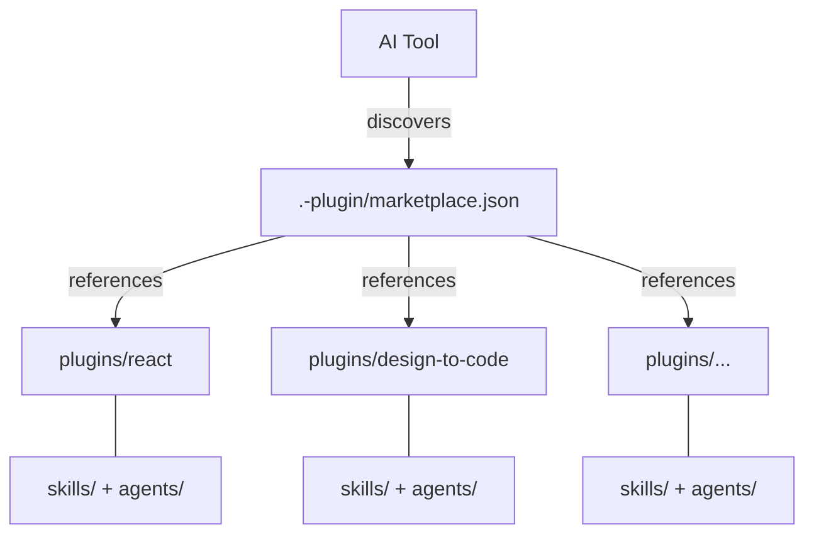

# PatternFly AI Helpers

[](./LICENSE)
[](./CONTRIBUTING.md)
[](./PLUGINS.md)

AI coding helpers for [PatternFly](https://www.patternfly.org/) development. This repository provides plugins and documentation to help AI tools generate accurate, best-practice PatternFly applications.

Plugins work in both **Claude Code** and **Cursor**. The content is identical — only the install path differs.

## Quick Start

### Claude Code

```bash
# Add the marketplace
/plugin marketplace add patternfly/ai-helpers

# Install the plugins you need
/plugin install react@ai-helpers
```

After installation, the plugin's agents and skills are available in any project.


### Cursor

#### Third-Party Plugin Import

If you've already installed plugins via Claude Code, Cursor can discover them automatically:

1. Open **Cursor Settings** → **Rules, Skills, Subagents**
2. Enable **"Include third-party Plugins, Skills, and other configs"**

Plugins installed via Claude Code appear immediately — no cloning or manual setup required.


#### Team Marketplace (Red Hat)

Red Hat Cursor Enterprise users have access to the PatternFly AI Helpers team marketplace:

1. Open **Cursor Settings** → **Plugins** → **Browse Marketplace**
2. Select **PatternFly AI Helpers**
3. Click **Get** on the plugins you need


## Available Plugins

<!-- BEGIN PLUGIN TABLE -->
| Plugin | Description |
|--------|-------------|
| **a11y** | Accessibility auditing, reporting, and documentation |
| **code-review** | Code review and quality — PR summaries, adversarial review, security patterns |
| **design-to-code** | Design-to-code translation — Figma review, token auditing, icon identification, design compliance |
| **migration** | PF version migration — breaking change detection, class scanning, upgrade planning |
| **pf-workshop** | PatternFly team tools and skill incubation — issue triage, release management, codebase auditing, new skill development |
| **react** | React component development — coding standards, testing, and structure |
<!-- END PLUGIN TABLE -->

See [PLUGINS.md](PLUGINS.md) for skills, agents, and usage details.

## PatternFly MCP Server (Recommended)

For the best experience, also install the [PatternFly MCP server](https://github.com/patternfly/patternfly-mcp) which gives AI tools access to component documentation, prop schemas, and design guidelines. Skills and agents work without it but provide enhanced results when it's available.

## Architecture



### How it works

1. Each AI tool looks for its own directory (`.claude-plugin/`, `.cursor-plugin/`) to find `marketplace.json`
2. The marketplace lists plugins with relative paths to `plugins/<name>/`
3. Each plugin has identical manifests in `.claude-plugin/plugin.json` and `.cursor-plugin/plugin.json`
4. Adding support for a new tool = copying the manifest into a new `.<tool>-plugin/` directory

## Repository Structure

```
ai-helpers/
├── .claude-plugin/       # Claude Code marketplace config
├── .cursor-plugin/       # Cursor marketplace config
├── plugins/
│   └── <plugin-name>/    # One directory per plugin
│       ├── .claude-plugin/
│       ├── .cursor-plugin/
│       ├── skills/
│       └── agents/
└── docs/                 # AI-friendly PatternFly documentation
```

## Documentation

The `docs/` directory contains comprehensive, AI-friendly PatternFly documentation. See [docs/README.md](docs/README.md) for the full table of contents.

## Security & Governance

See [SECURITY.md](SECURITY.md) for vulnerability reporting and [GOVERNANCE.md](GOVERNANCE.md) for how contributions are reviewed.

## Contributing

See [CONTRIBUTING.md](CONTRIBUTING.md) for guidelines on adding plugins, skills, and documentation.

See [CONTRIBUTING-SKILLS.md](CONTRIBUTING-SKILLS.md) for a step-by-step guide to creating and contributing a skill.

## References

- [PatternFly.org](https://www.patternfly.org/)
- [PatternFly React GitHub](https://github.com/patternfly/patternfly-react)
- [PatternFly MCP Server](https://github.com/patternfly/patternfly-mcp)

## License

[MIT](LICENSE)
