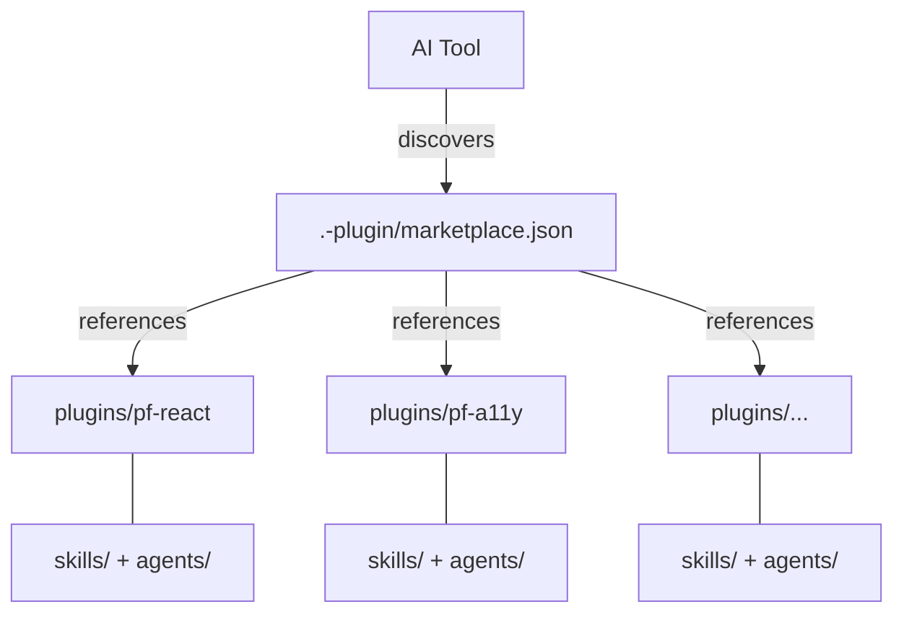

# PatternFly AI Helpers

AI coding helpers for [PatternFly](https://www.patternfly.org/) development. This repository provides plugins and documentation to help AI tools generate accurate, best-practice PatternFly applications.

Plugins work in both **Claude Code** and **Cursor**. The content is identical — only the install path differs.

## Quick Start

### Claude Code

```bash
# Add the marketplace
/plugin marketplace add patternfly/ai-helpers

# Install the PatternFly React plugin
/plugin install pf-react@ai-helpers
```

After installation, the plugin's agents and skills are available in any project.

### Cursor

Cursor can discover plugins from `.cursor-plugin/` directories. If you also have Claude Code installed, Cursor may pick up installed plugins automatically via its third-party plugin settings.

## Available Plugins

| Plugin | Description |
|--------|-------------|
| **pf-react** | PatternFly React coding standards, testing, and development |
| **pf-design-tokens** | Design token auditing, validation, and migration |
| **pf-a11y** | Accessibility auditing, reporting, and documentation |
| **pf-figma** | Figma design review, diffing, and asset identification |

Each plugin includes skills, agents, and a [PatternFly MCP server](https://github.com/patternfly/patternfly-mcp). Browse each plugin's `skills/` and `agents/` directories for what's available.

## Architecture



### How it works

1. Each AI tool looks for its own directory (`.claude-plugin/`, `.cursor-plugin/`) to find `marketplace.json`
2. The marketplace lists plugins with relative paths to `plugins/<name>/`
3. Each plugin has identical manifests in `.claude-plugin/plugin.json` and `.cursor-plugin/plugin.json`
4. Adding support for a new tool = copying the manifest into a new `.<tool>-plugin/` directory

## Repository Structure

```
ai-helpers/
├── .claude-plugin/       # Claude Code marketplace config
├── .cursor-plugin/       # Cursor marketplace config
├── plugins/
│   ├── pf-react/         # React coding standards, testing
│   ├── pf-design-tokens/ # Design token auditing and migration
│   ├── pf-a11y/          # Accessibility auditing and reporting
│   ├── pf-figma/         # Figma design review and diffing
│   └── pf-workflow/      # Issue tracking, PR management
└── docs/                 # AI-friendly PatternFly documentation
```

## Documentation

The `docs/` directory contains comprehensive, AI-friendly PatternFly documentation. See [docs/README.md](docs/README.md) for the full table of contents.

## Contributing

See [CONTRIBUTING.md](CONTRIBUTING.md) for guidelines on adding plugins, skills, and documentation.

See [CONTRIBUTING-SKILLS.md](CONTRIBUTING-SKILLS.md) for a step-by-step guide to creating and contributing a skill.

## References

- [PatternFly.org](https://www.patternfly.org/)
- [PatternFly React GitHub](https://github.com/patternfly/patternfly-react)
- [PatternFly MCP Server](https://github.com/patternfly/patternfly-mcp)

## License

[MIT](LICENSE)
